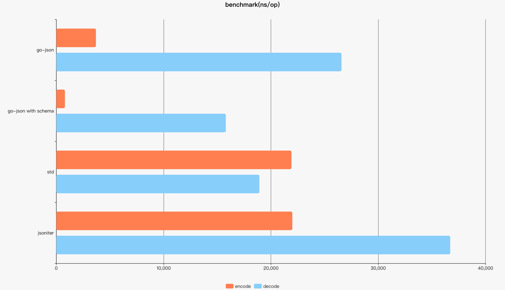

# go-json
基于simdjson-go的json解析库，旨在优化使用`map[string]interface{}`的json处理场景，与标准库`encoding/json`不兼容。

# 基准测试




Raw Result

|                 | ns/op       | allocation bytes | allocation times |
| --------------- | ----------- | ---------------- | ---------------- |
|go-json decode with schema         |         15796 ns/op      |      2529 B/op     |    25 allocs/op|
|std decode                          |        18924 ns/op        |    6597 B/op   |     110 allocs/op|
|go-json decode                       |       26578 ns/op        |    2800 B/op    |     67 allocs/op|
|jsoniter decode                      |       36709 ns/op        |    15349 B/op    |    323 allocs/op|

|                 | ns/op       | allocation bytes | allocation times |
| --------------- | ----------- | ---------------- | ---------------- |
|go-json encode (after decode with schema)   |        803 ns/op       |     1328 B/op     |     3 allocs/op|
|go-json encode                       |       3693 ns/op        |     1464 B/op     |     4 allocs/op|
|std encode                           |        21914 ns/op      |      8482 B/op    |    179 allocs/op|
|jsoniter encode                     |         21997 ns/op      |      8482 B/op     |   179 allocs/op|


# 用法

与标准库的用法不兼容，decode以后使用的库中的`Value`对象，替换用法如下：

标准库：
```go
import "encoding/json"

var testData = []byte("{\"object\":{\"a\":555,\"b\":false},\"success\":true}")
//decode
var res map[string]interface
err := json.Unmarshal(testData, &res)

//读取数据
res["success"].(bool) // true
object := res["object"].(map[string]interface{}) // {\"a\":555,\"b\":false}

object["a"].(int) // 555
object["b"].(bool) // false

//设置数据
object["new_key"] = 123

//encode
result, err := json.Marshal(res)
```

替代为：
```go
import "github.com/beckjiang/go-json"

var testData = []byte("{\"object\":{\"a\":555,\"b\":false},\"success\":true}")
//解析数据
val := NewNull()
err := val.Decode(testData)

//读取数据
val.ObjectVal([]byte("success")).Bool() // true
found, object := val.ObjectVal([]byte("object"))
object.ObjectVal([]byte("a")).Int() // 555
object.ObjectVal([]byte("b")).Bool() // false

//设置数据
object.SetObjectKV([]byte("new_key"), NewInt(123))

//encode
result := object.Encode(nil)
//用完释放，对象复用
val.DecRef()
```

# 如何获取

```bash
go get github.com/beckjiang/go-json
```
